# Fsi DREAM Demo in a Box Setup Guide
## Setup Instructions


## Requirements

* An Azure Account with the ability to create an Azure Synapse Workspace.
* A Power BI Pro or Premium account to host Power BI reports.
* Make sure you are the Power BI administrator for your account and service principal access is enabled on your Power BI tenant.
* Make sure the following resource providers are registered with your Azure Subscription.
   - Microsoft.Sql 
   - Microsoft.Synapse 
   - Microsoft.StreamAnalytics 
   - Microsoft.EventHub 
   - Microsoft.Media.MediaServices
* You can run only one deployment at any point in time and need to wait for its completion. You should not run multiple deployments in parallel as that will cause deployment failures.
* Select a region where the desired Azure Services are available. If certain services are not available, deployment may fail. See [Azure Services Global Availability](https://azure.microsoft.com/en-us/global-infrastructure/services/?products=all) for understanding target service availability. (consider the region availability for Synapse workspace, Iot Central and cognitive services while choosing a location)
* Do not use any special characters or uppercase letters in the environment code. Also, do not re-use your environment code.
* In this Accelerator we have converted Real-time reports into static reports for the ease of users but have covered entire process to configure Realtime dataset. Using those Realtime dataset you can create Realtime reports.
* Please ensure that you select the correct resource group name. We have given a sample name which may need to be changed should any resource group with the same name already exist in your subscription.
* The audience for this document is CSAs and GBBs.
* Please log in to Azure and Power BI using the same credentials.
* Once the resources have been setup, please ensure that your AD user and synapse workspace have “Storage Blob Data Owner” role assigned on storage account name starting with “stfsi”. You need to contact AD admin to get this done.

> **Note:** Please log in to Azure and Power BI using the same credentials.

## Setup Tasks:

<!-- TOC -->

  - [Task 1: Create a resource group in Azure](#task-1-create-a-resource-group-in-azure)
  - [Task 2: Create Power BI workspace](#task-2-create-power-bi-workspace)
  - [Task 3: Deploy the ARM Template](#task-3-deploy-the-arm-template)
  - [Task 4: Run the Cloud Shell](#task-4-run-the-cloud-shell)
  - [Task 5: Create Power BI reports and Dashboard](#task-5-create-power-bi-reports-and-dashboard)
  - [Task 6: Pause/Resume script](#task-10-pause-resume-resources)
  - [Task 7: Clean up environment](#task-11-clean-up-resources)

<!-- /TOC -->

### Task 1: Create a resource group in Azure

1. **Log into** the [Azure Portal](https://portal.azure.com) using your Azure credentials.

2. On the Azure Portal home screen, **select** the '+ Create a resource' tile.

	

3. In the Search the Marketplace text box, **type** "Resource Group" and **press** the Enter key.

	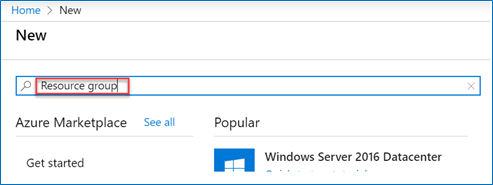

4. **Select** the 'Create' button on the 'Resource Group' overview page.

	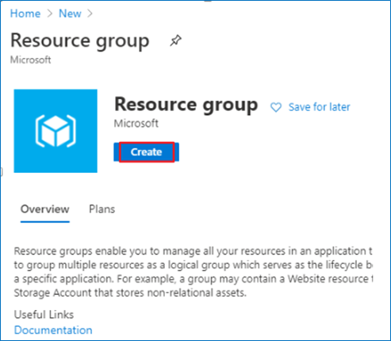
	
5. On the 'Create a resource group' screen, **select** your desired Subscription. For Resource group, **type** 'DDiB-FSI-Lab'. 

6. **Select** your desired region.

	> **Note:** Some services behave differently in different regions and may break some part of the setup. Choosing one of the following regions is preferable: 		westus2, eastus2, northcentralus, northeurope, southeastasia, australliaeast, centralindia, uksouth, japaneast.

7. **Click** the 'Review + Create' button.

	

8. **Click** the 'Create' button once all entries have been validated.

	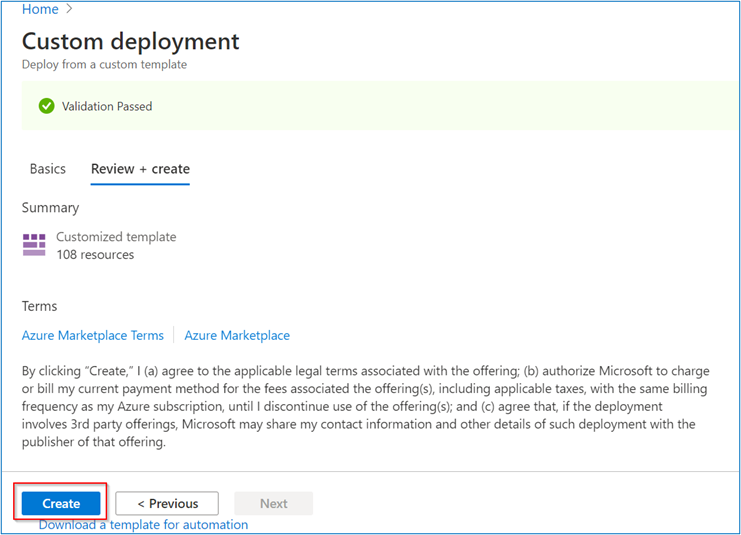

### Task 2: Power BI Workspace creation

1. **Open** Power BI in a new tab using the following link:  [https://app.powerbi.com/](https://app.powerbi.com/)

2. **Sign in**, to Power BI using your Power BI Pro account.

	

	> **Note:** Use the same credentials for Power BI which you will be using for the Azure account.

3. In Power BI service **Click** on 'Workspaces'.

4. Then **click** on the 'Create a workspace' tab.

	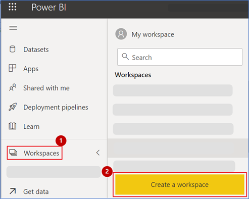

	> **Note:** Please create a Workspace by the name "DDiB-FSI".

5. **Copy** the Workspace GUID or ID. You can get this by browsing to [https://app.powerbi.com/](https://app.powerbi.com/), selecting the workspace, and then copying the GUID 	from the address URL.

6. **Paste** the GUID in a notepad for future reference.

	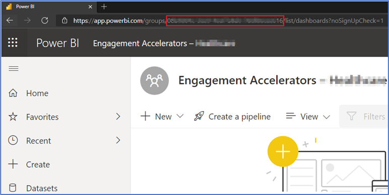

	> **Note:** This workspace ID will be used during ARM template deployment.

7. Go to your Power BI **workspace** and **click** on New button. 

8. Then **click** on **Streaming Dataset** option from the dropdown. 

	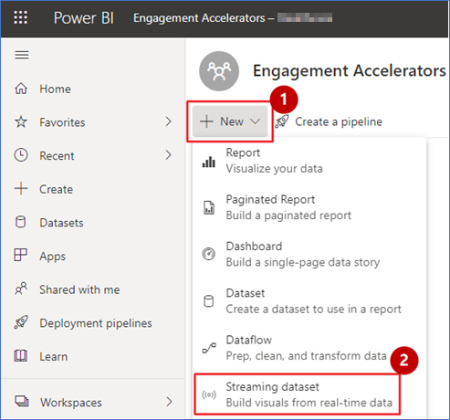

9. **Select API** from the list of options and **click** next. 

10. **Enable** the ‘Historic data analysis’ 

	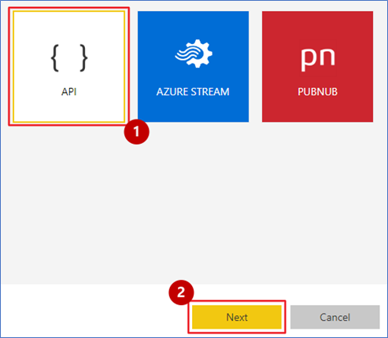

	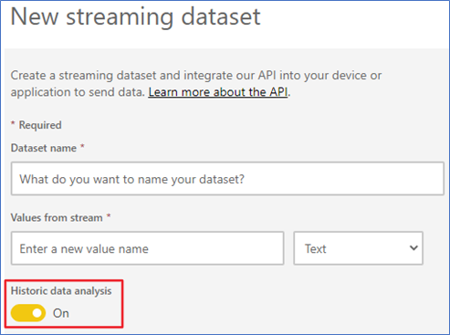

11. **Enter** ‘Before-scenario-cco-dataset’ as dataset name and **enter** the column names in “values from stream” option from list below  and **click** on create button: 
	- NPS 				:	number
	- TargetNPS  			:	number
	- CustomerChurn  		:	number
	- TargetCustomerChurn  		:	number
	- AccountOpeningTime  		:	number
	- TargetAccountOpeningTime  	:	number
	- RequestsWithinSLA  		:	number
	- TargetRequestsWithinSLA  	:	number
	- SocialSentiment  		:	text
	- NPSAfter  			:	number
	- TargetNPSAfter  		:	number
	- CustomerChurnAfter  		:	number
	- TargetCustomerChurnAfter  	:	number
	- AccountOpeningTimeAfter  	:	number
	- TargetAccountOpeningTimeAfter :	number
	- RequestsWithinSLAAfter  	:	number
	- TargetRequestsWithinSLAAfter  :	number
	- SocialSentimentAfter  	:	text
	
	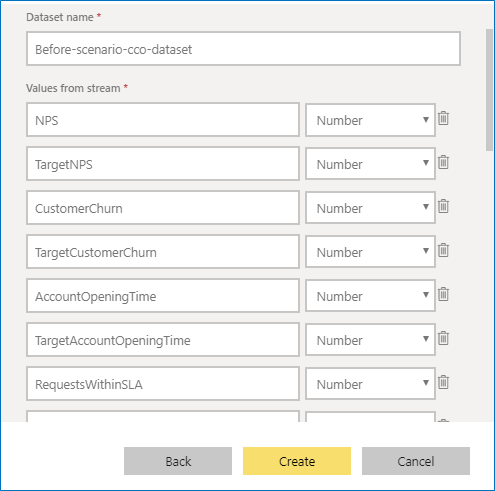

12. **Copy** the push url of dataset ‘Before-scenario-cco-dataset’ and place it in a notepad for later use.

	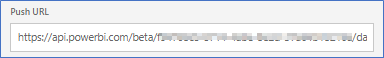

13. **Enter** ‘Before-scenario-financial-hcrr-dataset’ as dataset name and **enter** the column names in “values from stream” option from list below and **click** on create button: 
	- InvestigationResponseTime :number
	- TargetInvestigationResponseTime :number
	- PerfvsEfficiency :number
	- TargetPerfvsEfficiency :number
	- SanctionsAlertRate :number
	- TargetSanctionsAlertRate :number
	- OpenTransactionsAlertLevel1 :number
	- TargetOpenTransactionsAlertLevel1 :number
	- OpenTransactionsAlertLevel2 : number
	- TargetOpenTransactionsAlertLevel2 :number
	- AlertsClosedWithSLA :number
	- TargetAlertsClosedWithSLA :number
	- KYCAlertinSanctions :number
	- TargetKYCAlertinSanctions : number
	- KYCAlertinPEP:number
	- TargetKYCAlertinPEP: number
	- TargetKYCAlertinMedia : number
	- Vulnerabilities : number
	- KYCAlertinMedia:number
	- TargetVulnerabilities: number
	- InvestigationResponseTimeCyberSec : number
	- TargetInvestigationResponseTimeCyberSec: number
	- TerminatedEmployeesAccess: number
	- TargetTerminatedEmployeesAccess: number
	- UnauthorizedEmployees: number
	- TargetUnauthorizedEmployees: number
	- NoHardwareSecurity: number
	- TargetNoHardwareSecurity: number
	- CreditRiskExposure: number
	- TargetCreditRiskExposure: number
	- FinancialCrime: number
	- TargetFinancialCrime: number
	- TradingExposure: number
	- TargetTradingExposure: number
	- ESGAssets: number
	- TargetESGAssets: number
	- ClaimsProcessingCycleTime: number
	- TargetClaimsProcessingCycleTime: number
	- UnderwritingEfficiency: number
	- TargetUnderwritingEfficiency: number
	- OverallCreditRisk: number
	- TargetOverallCreditRisk: number
	- OverallOperationalRisk: number
	- TargetOverallOperationalRisk: number

	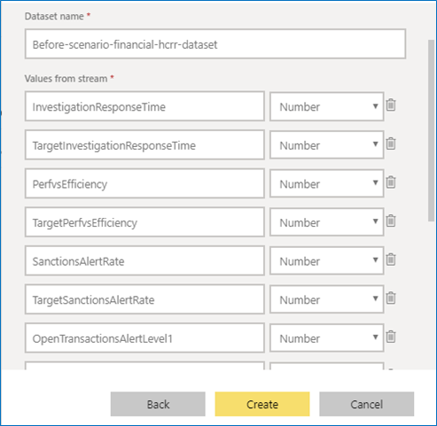

14. **Copy** the push url of dataset ‘Before-scenario-financial-hcrr-dataset’ and place it in a notepad for later use.

	

15. **Enter** ‘Before-after-scenario-group-ceo-dataset’ as dataset name and **enter** the column names in “values from stream” option from list below and **click** on create button:: 
	- CSAT :number
	- AverageAttrition :number
	- ComplianceScore :number
	- CustomerChurn :number
	- CustomerChurnAfter :number
	- EmployeeSatisfaction :number
	- EmployeeSatisfactionAfter :number
	- TargetCustomerChurn :number
	- TargetCustomerChurnAfter :datetime
	- TargetAverageAttrition :number
	- TargetEmployeeSatisfaction :number
	- TargetEmployeeSatisfactionAfter :number
	- TargetComplianceScore :number
	- RelativePerformancetoS&P500 :number
	- RelativePerformancetoS&P500After :number
	- TargetRelativePerformancetoS&P500 :number
	- TargetRelativePerformancetoS&P500After :number
	- QuarterlyClaimsProcessingEfficiency :number
	- QuarterlyClaimsProcessingEfficiencyAfter :number
	- TargetQuarterlyClaimsProcessingEfficiency :number
	- TargetQuarterlyClaimsProcessingEfficiencyAfter :number
	- CSRRating :number
	- CSRRatingAfter :number
	- TargetCSRRating :number
	- TargetCSRRatingAfter :number
	- ChannelEngagementRiskofChurn :number
	- ChannelEngagementRiskofChurnAfter :number
	- TargetChannelEngagementRiskofChurn :number

	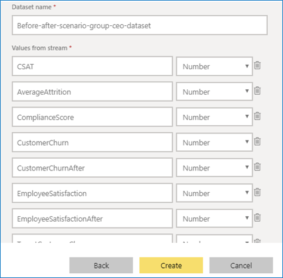

16. **Copy** the push url of dataset ‘Before-after-scenario-group-ceo-dataset’ and place it in a notepad for later use.

	

17. **Enter** ‘After-scenario-financial-hcrr-dataset’ as dataset name and **enter** the column names in “values from stream” option from list below and **click** on create button:

	- InvestigationResponseTime :number
	- TargetInvestigationResponseTime :number
	- PerfvsEfficiency :number
	- TargetPerfvsEfficiency :number
	- SanctionsAlertRate :number
	- TargetSanctionsAlertRate :number
	- OpenTransactionsAlertLevel1 :number
	- TargetOpenTransactionsAlertLevel1 :number
	- OpenTransactionsAlertLevel2 : number
	- TargetOpenTransactionsAlertLevel2 :number
	- AlertsClosedWithSLA :number
	- TargetAlertsClosedWithSLA :number
	- KYCAlertinSanctions :number
	- TargetKYCAlertinSanctions : number
	- KYCAlertinPEP:number
	- TargetKYCAlertinPEP: number
	- TargetKYCAlertinMedia : number
	- Vulnerabilities : number
	- KYCAlertinMedia:number
	- TargetVulnerabilities: number
	- InvestigationResponseTimeCyberSec : number
	- TargetInvestigationResponseTimeCyberSec: number
	- TerminatedEmployeesAccess: number
	- TargetTerminatedEmployeesAccess: number
	- UnauthorizedEmployees: number
	- TargetUnauthorizedEmployees: number
	- NoHardwareSecurity: number
	- TargetNoHardwareSecurity: number
	- CreditRiskExposure: number
	- TargetCreditRiskExposure: number
	- FinancialCrime: number
	- TargetFinancialCrime: number
	- TradingExposure: number
	- TargetTradingExposure: number
	- ESGAssets: number
	- TargetESGAssets: number
	- TargetClaimsProcessingCycleTime: number
	- UnderwritingEfficiency: number
	- TargetUnderwritingEfficiency: number
	- OverallCreditRisk: number
	- TargetOverallCreditRisk: number
	- OverallOperationalRisk: number
	- TargetOverallOperationalRisk: number

	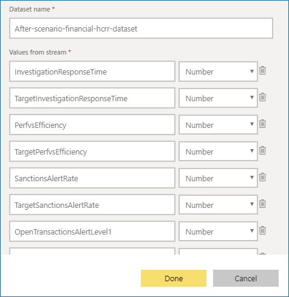

18. **Copy** the push url of dataset ‘After-scenario-financial-hcrr-dataset’ and place it in a notepad for later use.

	

19. **Navigate** to [https://www.videoindexer.ai/](https://www.videoindexer.ai/).

20. **Click** on AAD Account.

	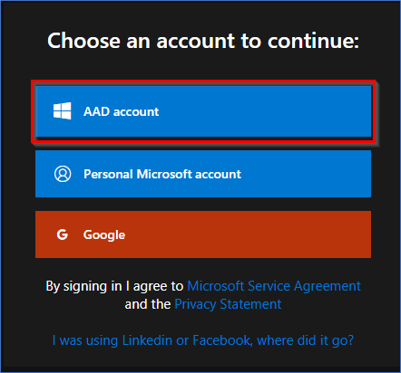

	> **Note:** You may be prompted to enter the azure credentials.

21. **Click** on Account settings.

22. **Copy** the Account ID in a notepad. This will be needed during template deployment.

	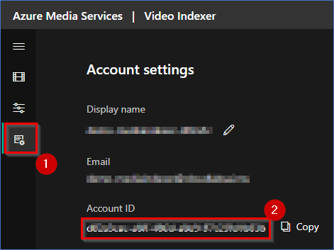

23. **Navigate** to [https://api-portal.videoindexer.ai/](https://api-portal.videoindexer.ai/).

24. **Click** sign in if not already signed in.

25. **Click** on profile.

26. **Copy** the primary key. This will be needed during template deployment.

	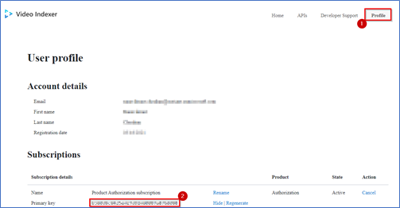


### Task 3: Deploy the ARM Template

1. **Open** this link in a new tab of the same browser that you are currently in: 
	
	<a href='https://portal.azure.com/#create/Microsoft.Template/uri/https%3A%2F%2Fraw.githubusercontent.com%2Fmicrosoft%2FAzure-Analytics-and-AI-Engagement%2Ffsi%2Ffsidemo%2FmainTemplate.json' target='_blank'></a>

2. On the Custom deployment form, **select** your desired Subscription.

3. **Select** the resource group name **DDiB-FSI-Lab** which you created in [Task 1](#task-1-create-a-resource-group-in-azure).

4. **Provide/Type** an environment code which is unique to your environment. This code is a suffix to your environment and should not have any special characters or uppercase letters and should not be more than 6 characters. 

5. **Provide** a strong SQL Administrator login password and set this aside for later use.

6. **Enter** the Power BI workspace ID created in [Task 2](#task-2-power-bi-workspace-creation).

7. **Enter** the power BI streaming dataset url for **Before-scenario-financial-hcrr-dataset** you copied in step 14 of task 2.

8. **Enter** the power BI streaming dataset url for **After-scenario-financial-hcrr-dataset** you copied in step 18 of task 2.

	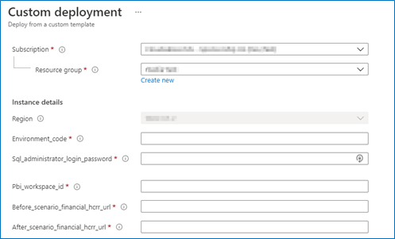

9. **Enter** the power BI streaming dataset url for **Before-scenario-cco-dataset** you copied in step 12 of task 2.

10. **Enter** the power BI streaming dataset url for **Before-after-scenario-group-ceo-dataset** you copied in step 16 of task 2.

11. **Enter** video indexer account id and api key copied earlier.

12. **Enter** Luis cog service location from given drop down.

13. **Click** ‘Review + Create’ button.

	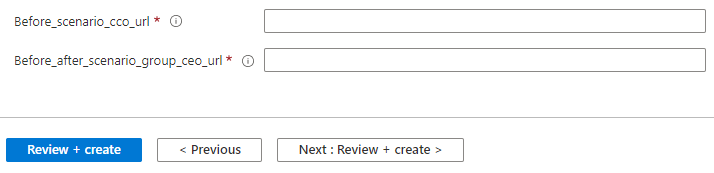

14. **Click** the **Create** button once the template has been validated.

	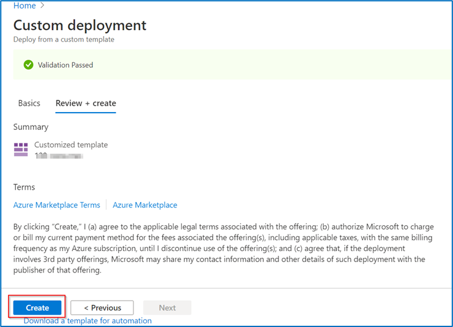

	> **NOTE:** The provisioning of your deployment resources will take approximately 20 minutes.

15. **Stay** on the same page and wait for the deployment to complete.
    
	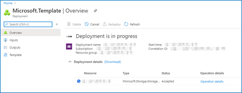
    
16. **Select** the **Go to resource group** button once your deployment is complete.

	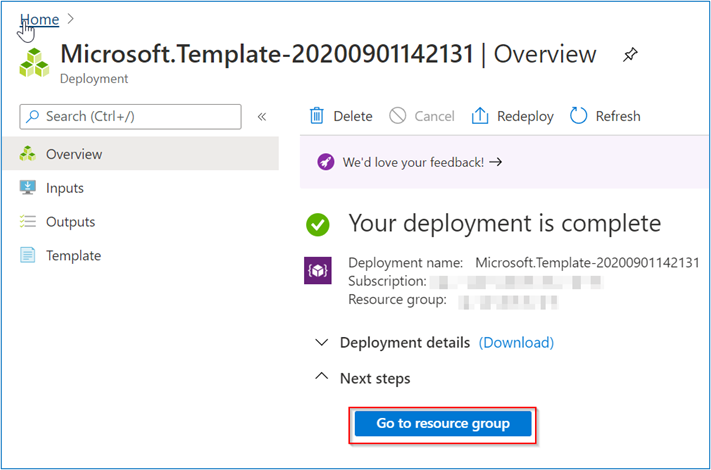

### Task 4: Run the Cloud Shell to provision the demo resources

**Open** the Azure Portal.

1. In the Resource group section, **open** the Azure Cloud Shell by selecting its icon from the top toolbar.

	

2. **Click** on 'Show advanced settings'.

	

	> **Note:** If you already have a storage mounted for Cloud Shell, you will not get this prompt. In that case, skip step 2 and 3.

3. **Select** your 'Resource Group' and **enter** the 'Storage account' and 'File share' name.

	

	> **Note:** If you are creating a new storage account, give it a unique name with no special characters or uppercase letters.

4. In the Azure Cloud Shell window, **enter** the following command to clone the repository files.
Command:
```
git clone -b fsi https://github.com/microsoft/Azure-Analytics-and-AI-Engagement.git fsi
```

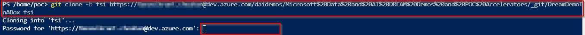
	
> **Note:** If you get File already exist error, please execute following command: rm fsi -r -f to delete existing clone.

> **Note**: When executing scripts, it is important to let them run to completion. Some tasks may take longer than others to run. When a script completes execution, you will be returned to a command prompt. 

5. **Execute** the fsiSetup.ps1 script by executing the following command:
Command:
```
cd ./fsi/fsidemo
```

6. Then **run** the PowerShell: 
```
./fsiSetup.ps1
```
    
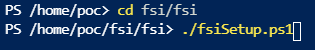
      
7. From the Azure Cloud Shell, **copy** the authentication code

8. Click on the link [https://microsoft.com/devicelogin](https://microsoft.com/devicelogin) and a new browser window will launch.

	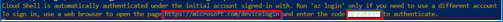
     
9. **Paste** the authentication code.

	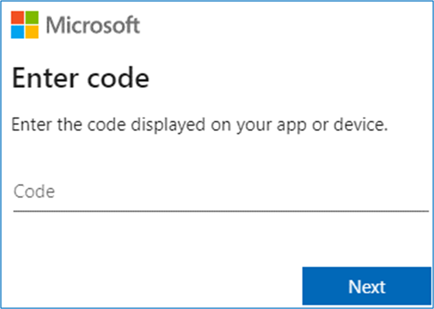

10. **Select** the same user that you used for signing in to the Azure Portal in [Task 1](#task-1-create-a-resource-group-in-azure).

	

11. **Close** the browser tab once you see the message window at right and **go back** to your Azure Cloud Shell execution window.

	
	
12. **Navigate back** to the resource group tab.

13. You will get another code to authenticate an Azure PowerShell script for creating reports in Power BI. **Copy** the code.

14. **Click** the link [https://microsoft.com/devicelogin](https://microsoft.com/devicelogin).

	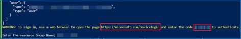

15. A new browser window will launch.

16. **Enter** the authentication code you copied from the shell above.

	

17. Again, **select** the same user to authenticate which you used for signing into the Azure Portal in [Task 1](#task-1-create-a-resource-group-in-azure).

	
	
18. **Close** the browser tab once you see the message window at right, and then go back to your Azure Cloud Shell execution window.

	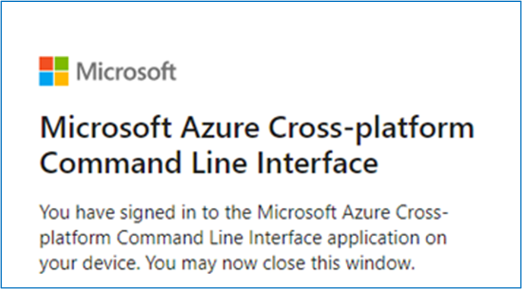

	> **Notes:**
	> - While you are waiting for processes to get completed in the Azure Cloud Shell window, you'll be asked to enter the code three times. This is necessary for performing installation of various Azure Services and preloading content in the Azure Synapse Analytics SQL Pool tables.
	> - You may be prompted to choose a subscription after the above-mentioned step if you have multiple subscriptions associated with your account. Choose the **subscription** that you used to sign in to the Azure portal. 

19. You will now be prompted to **enter** the resource group name in the Azure Cloud Shell. Type the same resource group name that you created in [Task 1](#task-1-create-a-resource-group-in-azure). – 'DDiB-FSI-Lab'.

	

20. You will be prompted for choice between Unlimited Video indexer account and a trial account.

21. If you do not have unlimited account, **enter** N.

	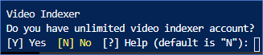

	> **Note (optional):** Follow Instructions at this [link](https://docs.microsoft.com/en-us/azure/media-services/video-indexer/connect-to-azure) to create an unlimited VI account.

22. You will get another code to authenticate an Azure PowerShell script for creating reports in Power BI. **Copy** the code.

23. **Click** the link [https://microsoft.com/devicelogin](https://microsoft.com/devicelogin).

      
      
24. A new browser window will launch. **Paste** the code that you copied from the shell in step 21.

	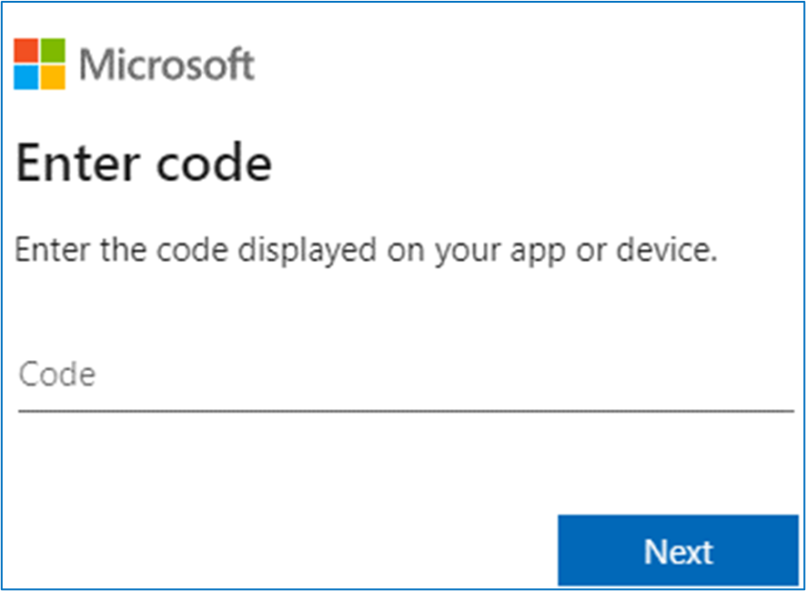

	> Note: Make sure to provide the device code before it expires and let the script run till completion.

25. **Select** the same user to authenticate which you used for signing into the Azure Portal in [Task 1](#task-1-create-a-resource-group-in-azure). 

	

26. **Close** the browser tab once you see the message window at right and go back to your Azure Cloud Shell execution window.

	

	> **Note:** The deployment will take approximately 40-45 minutes to complete. Keep checking the progress with messages printed in the console to avoid timeout.
      
### Task 5: Power BI reports and dashboard creation 

1. **Open** Power BI in a new tab using the following link
        [https://app.powerbi.com/](https://app.powerbi.com/).

2. **Sign into** Power BI. Use the same Azure account you have used throughout this setup process.

	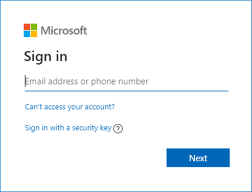

3. **Select** the Workspace, which is created in [Task2](#task-2-create-power-bi-workspace).

	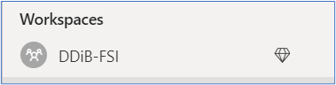

Once [Task 4](#task-4-run-the-cloud-shell-to-provision-the-demo-resources) has been completed successfully and the template has been deployed, you will be able to see a set of reports in the Reports tab of Power BI, and real-time datasets in the Dataset tab. 

The image on the right shows the Reports tab in Power BI.  We can create a Power BI dashboard by pinning visuals from these reports. 

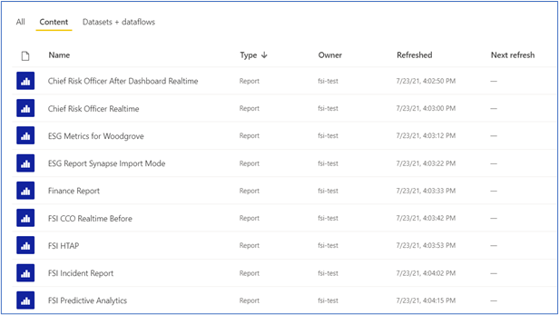

To give permissions for the Power BI reports to access the data sources:

4. **Click** the ellipses or settings icon on top right-side corner.

5. **Click** the settings button.

	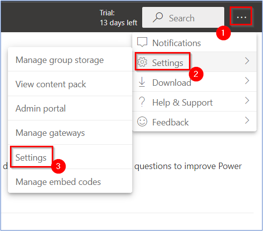

6. **Click** 'Datasets' tab.

	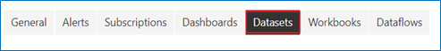

7. **Click** on the first Dataset.
8. **Expand** Data source credentials.
9. **Click** Edit credentials and a dialogue box will pop up.

	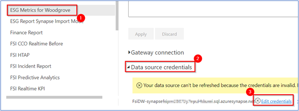

10. **Enter** Username as ‘labsqladmin’.

11. **Enter** the same SQL Administrator login password that was created for [Task 3](#task-3-deploy-the-arm-template) Step #5

12. **Click** Sign in.

	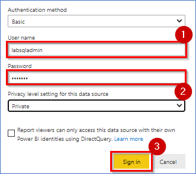

Follow these steps to create the Power BI dashboard:

13. **Select** the workspace in [Task2](#task-2-create-power-bi-workspace).

	

14. **Click** on ‘+ New’ button on the top-left navigation bar.

15. **Click** the ‘Dashboard’ option from the drop-down menu.

	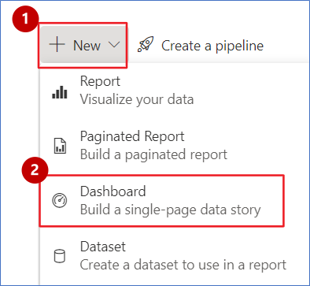

16. **Name** the dashboard ‘Fsi Dashboard-Before’ and **click** “create”. 

17. This new dashboard will appear in the Dashboard section (of the Power BI workspace). 

	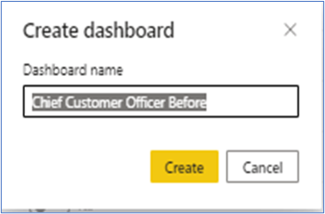

Follow the below steps to change the dashboard theme:

18. **Open** the URL in a new browser tab to get JSON code for a custom theme:
https://raw.githubusercontent.com/microsoft/Azure-Analytics-and-AI-Engagement/main/HealthCare/CustomTheme.json

19. **Right click** anywhere in browser and **click** 'Save as...'.

20. **Save** the file to your desired location on your computer, leaving the name unchanged.

	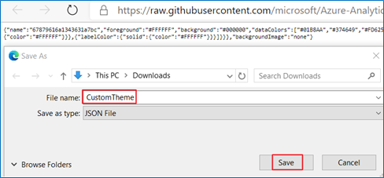

21. **Go back** to the Power BI dashboard you just created.

22. **Click** on the “Edit” at the top.

23. **Click** on “Dashboard theme”.

	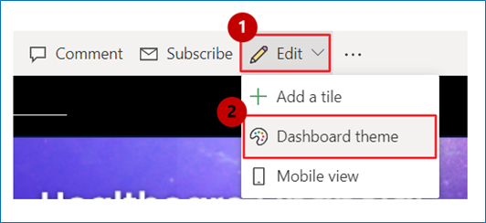

24. **Click** ‘Upload the JSON theme’.

25. **Navigate** to the location where you saved the JSON theme file in the steps above and **select** open.

26. **Click** Save.

	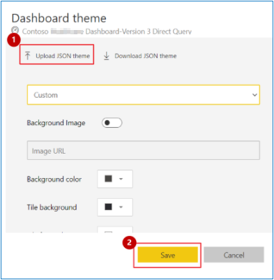

Do the following to pin visuals to the dashboard you just created: 
**Pillar 1: Video & Revenue Analytics**

27. **Select** the workspace [Task2](#task-2-create-power-bi-workspace).

	

28. **Click** on the “Content” section/tab.

	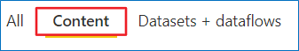

29. In the “Content” section, there will be a list of all the published reports.

30. **Click** on ‘Video & Revenue Analytics’.

31. **Click** on ‘Video & Revenue Analytics Before’ page. 

	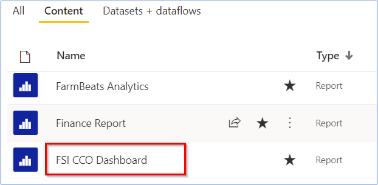

32. On the Video and revenue analytics page, **click** the ‘Net Margin’ visual and **click** the pin icon.

	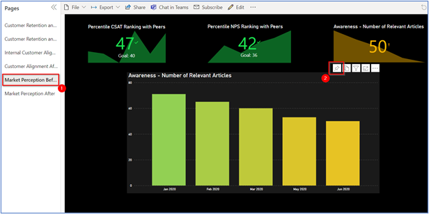

33. **Select** ‘Existing dashboard’ radio button. 

34. From ‘select existing dashboard’ dropdown, **select** ‘Fsi Dashboard-Before’.

35. **Click** ‘Pin’.

	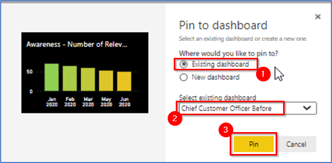

36. Similarly, **pin** ‘YoY Growth (YTD)’, ‘Total Videos in Library’, ‘Churn Ratio’ and ‘Top 5 Categories’ from the report.

	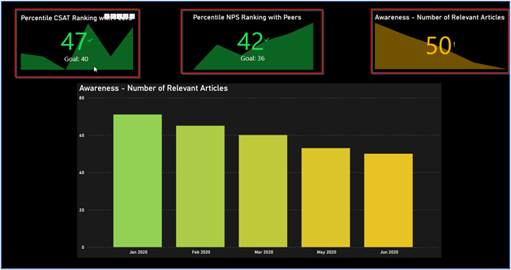

37. **Select** the Workspace in [Task2](#task-2-create-power-bi-workspace).

	

38. **Open** ‘Fsi Master Images’ report and click edit.

39. **Pin** all the images from report to the ‘Fsi Dashboard-Before’ dashboard.

40. **Note:** Please refer to steps 32-35 of Task 5 for the complete procedure of pinning a desired visual to a dashboard.

	

41. **Go back** to the ‘Fsi Dashboard-Before’ dashboard.

	

42. **Go back** to the ‘Fsi Dashboard-Before’ dashboard.

	

To hide title and subtitle for all the images that you have pined above. Please do the following:

43. **Click** on ellipsis ‘More Options’ of the image you selected.

44. **Click** ‘Edit details’.

	

45. **Uncheck** ‘Display title and subtitle’.

46. **Click** ‘Apply’.

47. **Repeat** Step 46 to 48 for all image tiles.

	

48. After disabling ‘Display title and subtitle’ for all images, **resize** and **rearrange** the top images tiles as shown in the screenshot. Resize the Contoso Healthcare logo to 1x1 size; resize other vertical tiles to 2x1 size.  

	

49. **Resize** and **rearrange** the left images tiles as shown in the screenshot. Resize the KPI tile to 1x2. Resize the Deep Dive to 1x4.

	

50. **Refer** to the screenshot of the sample dashboard and pin the visuals to replicate its look and feel. 

51. **First** pillar ‘Video & Revenue Analytics’ is completed.

	

**Pillar 2: Audience Analytics**

52. Let’s **start** Pinning the second pillar ‘Audience Analytics’.

53. **Select** the Workspace in [Task2](#task-2-create-power-bi-workspace).

		

54. **Open** ‘Audience Analytics’ report.

55. **Click on** ‘Audience Analytics Before’ page.

	

56. Similarly, **pin** ‘Active Viewer’, ‘Unique Sessions’, ‘Video Completion Rate’,

57. ‘Average Session Time’ and ‘Last 7 days Viewership’ from the report to the ‘Fsi Dashboard-Before’ dashboard.

	

58. **Select** the Workspace in [Task2](#task-2-create-power-bi-workspace).

	

59. **Open** ‘Video & Revenue Analytics’ report.

60. **Click** on ‘Video & Revenue Analytics Before’ page.

	

61. On the Video & Revenue Analytics report page, **click** the ‘Net Margin’ visual and **click** the pin icon.

	

62. **Refer** to the screenshot of the sample dashboard and pin the visuals to replicate its look and feel. 

63. **Second** pillar ‘Audience Analytics’ is completed.

	

**Pillar 3:  Realtime Operational Analytics** 

64. Let’s **start** Pinning the third pillar ‘Realtime Operational Analytics’

65. **Select** the Workspace in [Task2](#task-2-create-power-bi-workspace).

	
	
66. **Open** ‘Realtime Operational Analytics’ report.

	
	
67. **Click** on ‘Realtime Operational Analytics Before’ page.

68. Similarly, **pin** ‘Current Sessions’, ’Current Viewers’, ’Sessions Time (IN MINUTES)’,’Video Response Time (IN MILLISECONDS)’,’Streaming Devices’, ’Sessions by Video Categories (in Minutes)’ from the report to the ‘Fsi Dashboard-Before’ dashboard.

	
	
69. **Refer** to the screenshot of the sample dashboard and pin the visuals to replicate its look and feel. 

70. **Third** pillar ‘Realtime Operational Analytics’ is completed.

	

**Pillar 4:   Realtime Twitter Analytics**

71. Let’s **start** Pinning the fourth pillar ‘Realtime Twitter Analytics’.

72. **Select** the Workspace in [Task2](#task-2-create-power-bi-workspace).

	

73. In the “Reports” section, there will be a list of all the published reports.

74. **Click** on ‘Fsi Twitter Report’ Report.

	

75. Similarly, **pin** ‘Avg. Sentiment Score’,’No. of Tweets’, ’Retweets’, ’Engagement by Hour on Day’, ’Hashtag by sentiment score’ from the report .

	
  
76. **Refer** to the screenshot of the sample dashboard and pin the visuals to replicate its look and feel.

77. **Fourth** pillar ‘Realtime Twitter Analytics’ is completed.

	

78. After pinning all the pillars and Dashboard images the final dashboard will look like this
  
	

**Task 6: Pause/Resume resources**

> **Note:** Please perform these steps after your demo is done and you do not need the environment anymore. Also ensure you Resume the environment before demo if you paused it once. 
 
1. **Open** the Azure Portal 

2. **Click** on the Azure Cloud Shell icon from the top toolbar. 

	

**Execute** the Pause_Resume_script.ps1 script by executing the following command: 
1. **Run** Command: 
	```
	cd "fsi\fsidemo"
	```

2. Then **run** the PowerShell script: 
	```
	./pause_resume_script.ps1 
	```
	
	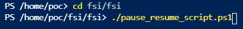
	
3. From the Azure Cloud Shell, **copy** the authentication code
	
	
	
4. Click on the link [https://microsoft.com/devicelogin](https://microsoft.com/devicelogin) and a new browser window will launch.
	
5. **Paste** the authentication code.
	
	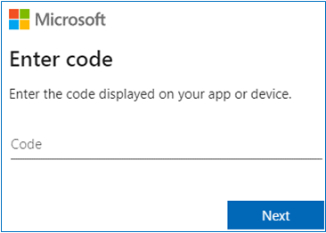
	
6. **Select** the same user that you used for signing into the Azure Portal in [Task 1](#task-1-create-a-resource-group-in-azure). 

7. **Close** this window after it displays successful authentication message.

	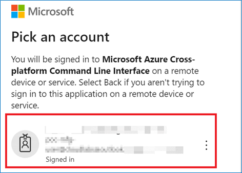

8. When prompted, **enter** the resource group name to be paused/resumed in the Azure Cloud Shell. Type the same resource group name that you created. 
	
	

9. **Enter** your choice when prompted. Enter ‘P’ for **pausing** the environment or ‘R’ for **resuming** a paused environment. 

10. Wait for script to finish execution. 

	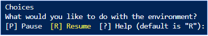

**Task 7: Clean up resources.**

> **Note: Perform these steps after your demo is done and you do not need the resources anymore**

**Open** the Azure Portal.

1. Open the Azure Cloud Shell by **clicking** its icon from the top toolbar.

	

**Execute** the resourceCleanup.ps1 script by executing the following:

2. **Run** Command: 
	```
	cd "fsi\fsidemo"
	```

3. Then **run** the PowerShell script: 
	```
	./resource_cleanup.ps1
	```

	

4. You will now be prompted to **enter** the resource group name to be deleted in the Azure Cloud Shell. Type the same resource group name that you created in [Task 1](#task-1-create-a-resource-group-in-azure) - 'DDib-FSI'.

5. You may be prompted to select a subscription in case your account has multiple subscriptions.

	
	
Your Dream Demo in a Box environment is now set up.
